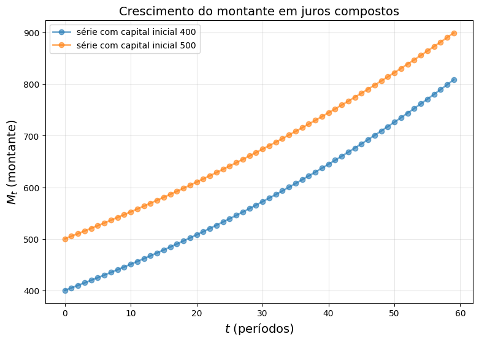
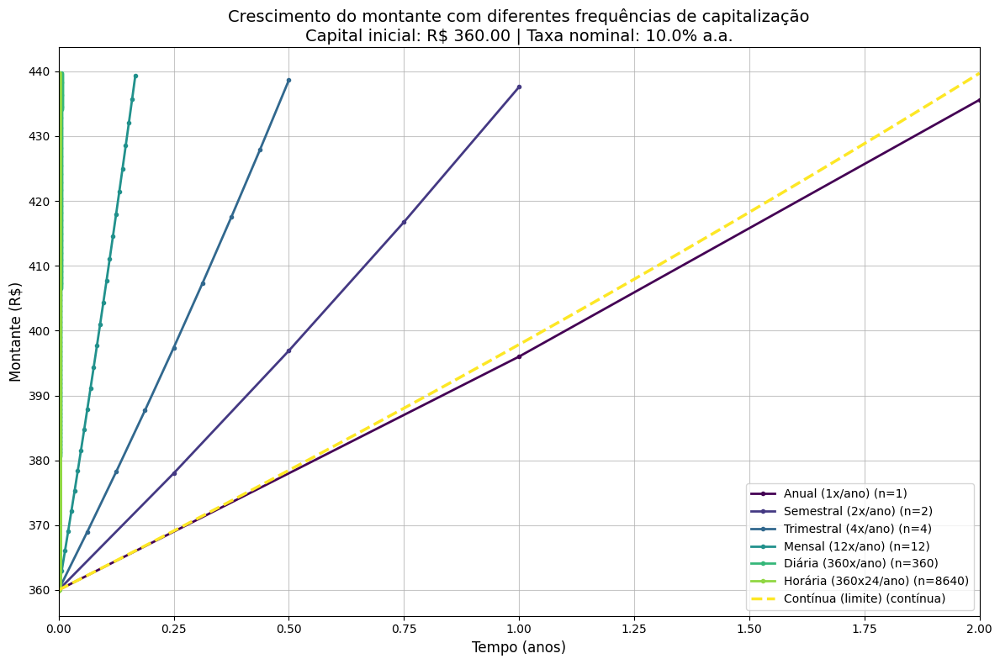

## Receita para fazer o dinheiro crescer

A receita para fazer o seu dinheiro crescer é simples e leva poucos ingredientes. Basta juntar o fermento à massa e esperar a mágica acontecer. A massa corresponde ao capital inicial (os recursos disponíveis para investimento), enquanto o fermento representa os juros, o elemento que faz o montante crescer. Contudo, para que a receita funcione, é preciso um terceiro ingrediente, comum aos dois domínios, que em tese é abundante e está disponível para todos: o tempo.

Mas há um detalhe que torna a analogia imperfeita: na culinária, se deixarmos a massa crescer além do prazo determinado, ela desanda e estraga a receita. Com o dinheiro, ao contrário, a lógica é oposta: quanto mais tempo, maior o potencial de crescimento, sem um ponto de interrupção natural. Se abstrairmos as variáveis que interferem no processo, percebemos que a dinâmica dos juros compostos depende tanto da taxa quanto da frequência com que os juros são capitalizados: quanto maior a frequência de capitalização, maior o valor futuro ao longo do tempo.

É justamente essa ideia de aumentar indefinidamente a frequência dos períodos de capitalização que nos leva ao conceito de capitalização *contínua*, estudado por **Peter Garrity** em *Matemática aplicada aos negócios*. Nesse regime, o crescimento exponencial do montante é expresso matematicamente por meio do *número de Euler*, representado pela letra $$e$$, uma constante irracional aproximadamente igual a **2,71828**. Essa constante, que é a base dos logaritmos naturais, aparece naturalmente quando simulamos a capitalização em intervalos infinitesimais, isto é, quando o tempo é dividido em infinitos períodos.

Para visualizar esse comportamento na prática, podemos utilizar um exemplo de código em Python. A seguir, representamos graficamente o crescimento do montante em função do tempo à medida que aumentamos a frequência de capitalização.


Para isso, adaptamos uma classe originalmente criada para implementar o modelo de crescimento de **Solow**, disponível em:
https://python-programming.quantecon.org/python_oop.html.

**Criamos a Classe `Montante`**

```python
class Montante:
    r"""
    Inicializa uma instância de juros compostos, que é uma PG específica.

        M_{t+1} = M_t * (1 + i)
      
    """
    def __init__(self, n=2,  # número de períodos (não usado recursivamente)
                       C=400,  # capital inicial
                       i=0.01,  # taxa de juros
                       M=1):  # montante atual

        self.n, self.C, self.i = n, C, i
        self.M = M if M != 1 else C  # Se M não foi fornecido, usa C como inicial

    def h(self):
        "Avalia a função h - atualiza o montante com juros"
        # Desempacota os parâmetros
        i = self.i
        # Aplica a regra de atualização recursiva: M_{t+1} = M_t * (1 + i)
        return self.M * (1 + i)

    def update(self):
        "Atualiza o estado atual (ou seja, o montante)."
        self.M = self.h()

    def reset(self):
        """Reinicia o estado para o capital inicial"""
        self.M = self.C

    def generate_sequence(self, t):
        "Gera e retorna uma série temporal de comprimento t"
        # Reinicia para o capital inicial antes de gerar a sequência
        self.M = self.C
        
        path = []
        for _ in range(t):
            path.append(self.M)
            self.update()
        return path
```

**Visualizamos a série temporal**


```python
import matplotlib.pyplot as plt

# Criando duas instâncias
m1 = Montante(C=400, i=0.012)
m2 = Montante(C=500, i=0.01)

T = 60
fig, ax = plt.subplots(figsize=(9, 6))

# Plota a série temporal para cada investimento
for m in [m1, m2]:
    lb = f'série com capital inicial {m.C}'
    seq = m.generate_sequence(T)
    ax.plot(seq, 'o-', lw=2, alpha=0.6, label=lb)

ax.set_xlabel('$t$ (períodos)', fontsize=14)
ax.set_ylabel('$M_t$ (montante)', fontsize=14)
ax.set_title('Crescimento do montante em juros compostos', fontsize=14)
ax.legend()
ax.grid(True, alpha=0.3)
plt.show()
```


    

    


**Criamos a Classe `ValorFuturo`**

Vamos criar uma classe `ValorFuturo` que herda de `Montante`. A classe `Montante` implementa o caso mais simples de juros compostos, enquanto `ValorFuturo` generaliza para diferentes frequências de capitalização. 


```python
import numpy as np

class ValorFuturo(Montante):
    r"""
    Classe que herda de Montante e implementa capitalização periódica.

    Fórmula: M = C * (1 + i/n)^(n*t)
    
    Onde:
        C = capital inicial
        i = taxa nominal anual (ex: 0.10 para 10% a.a.)
        n = número de períodos de capitalização por ano
        t = tempo em anos
    
    Esta classe generaliza o conceito de Montante para diferentes frequências
    de capitalização, mantendo a mesma estrutura básica.
    """
    
    def __init__(self, C=100,        # capital inicial
                       i=0.10,       # taxa nominal anual (10% a.a.)
                       n=1,          # períodos de capitalização por ano
                       t=0):         # tempo em anos (estado atual)
        
        # Chama o construtor da classe pai (Montante)
        # Passa n, C, e a taxa por período (i/n)
        super().__init__(n=n, C=C, i=i/n, M=C)
        
        # Adiciona novos atributos específicos da classe ValorFuturo
        self.taxa_nominal_anual = i  # taxa nominal anual original
        self.tempo_anos = t           # tempo em anos
        self.periodos_por_ano = n     # número de capitalizações por ano
    
    def h(self):
        """
        Sobrescreve o método h da classe pai.
        Avalia a função h - atualiza o montante com juros compostos.
        
        A taxa por período já foi ajustada no construtor (i_periodo = i_anual/n)
        Portanto, usamos a mesma lógica da classe pai: M * (1 + taxa_periodo)
        """
        # Reutiliza o método h da classe pai (Montante)
        # que já calcula M * (1 + self.i), onde self.i agora é a taxa por período
        return super().h()
    
    def update(self, dt=1):
        """
        Atualiza o estado atual (montante e tempo).
        
        Parâmetros:
        dt: incremento de tempo em anos (padrão = 1 período de capitalização)
        """
        # Atualiza o montante usando o método da classe pai
        super().update()
        
        # Atualiza o tempo em anos
        self.tempo_anos += dt / self.periodos_por_ano
    
    def montante_teorico(self, t_anos):
        """
        Calcula o montante para um período específico (fórmula fechada).
        Usando a fórmula: M = C * (1 + i/n)^(n*t)
        """
        C = self.C
        i_nominal = self.taxa_nominal_anual
        n = self.periodos_por_ano
        
        return C * (1 + i_nominal / n) ** (n * t_anos)
    
    def reset(self):
        """Reinicia o estado para o capital inicial e tempo zero"""
        # Chama o método reset da classe pai (Montante)
        # Isso reinicia self.M = self.C
        super().reset()
        # Reinicia o tempo em anos
        self.tempo_anos = 0
    
    def generate_sequence(self, t_anos, passos_por_ano=None):
        """
        Gera e retorna uma série temporal de montantes.
        
        Parâmetros:
        t_anos: tempo total em anos
        passos_por_ano: número de passos por ano (se None, usa a frequência de capitalização)
        """
        # Reinicia para o capital inicial antes de gerar a sequência
        self.reset()
        
        # Define o número de passos por ano
        if passos_por_ano is None:
            passos_por_ano = self.periodos_por_ano
        
        # Número total de passos
        num_passos = int(t_anos * passos_por_ano)
        
        path = []
        tempo = []
        
        for passo in range(num_passos + 1):
            path.append(self.M)
            tempo.append(self.tempo_anos)
            
            # Atualiza para o próximo período
            dt = 1 / passos_por_ano  # incremento de tempo em anos
            self.update(dt)
        
        return tempo, path

```

**Definimos a função para visualizar diferentes períodos de capitalização**


```python
def comparar_capitalizacoes(C=100, i=0.10, t_anos=2):
    """
    Compara o crescimento do montante para diferentes frequências de capitalização.
    
    Parâmetros:
    C: capital inicial
    i: taxa nominal anual
    t_anos: tempo total em anos
    """
    # Diferentes frequências de capitalização
    capitalizacoes = {
        'Anual (1x/ano)': 1,
        'Semestral (2x/ano)': 2,
        'Trimestral (4x/ano)': 4,
        'Mensal (12x/ano)': 12,
        'Diária (360x/ano)': 360,
        'Horária (360x24/ano)': 8640,
        'Contínua (limite)': None  # Caso especial para capitalização contínua
    }
    
    fig, ax = plt.subplots(figsize=(12, 8))
    
    cores = plt.cm.viridis(np.linspace(0, 1, len(capitalizacoes)))
    
    for (nome, n), cor in zip(capitalizacoes.items(), cores):
        if n is None:
            # Capitalização contínua: M = C * e^(i*t)
            tempo = np.linspace(0, t_anos, 1000)
            montante = C * np.exp(i * tempo)
            ax.plot(tempo, montante, '--', linewidth=2.5, color=cor, 
                   label=f'{nome} (contínua)')
            # Calcula o montante final para a tabela
            m_final = C * np.exp(i * t_anos)
            print(f'{nome}: R$ {m_final:.2f}')
        else:
            # Capitalização discreta
            invest = ValorFuturo(C=C, i=i, n=n)
            tempo, montante = invest.generate_sequence(t_anos, passos_por_ano=n)
            ax.plot(tempo, montante, 'o-', linewidth=2, markersize=3, color=cor,
                   label=f'{nome} (n={n})')
            
            # Calcula o montante final para a tabela
            m_final = invest.montante_teorico(t_anos)
            print(f'{nome}: R$ {m_final:.2f}')
    
    ax.set_xlabel('Tempo (anos)', fontsize=12)
    ax.set_ylabel('Montante (R$)', fontsize=12)
    ax.set_title(f'Crescimento do montante com diferentes frequências de capitalização\n'
                f'Capital inicial: R$ {C:.2f} | Taxa nominal: {i*100:.1f}% a.a.',
                fontsize=14)
    ax.legend(loc='lower right', fontsize=10)
    ax.grid(True, alpha=0.7)
    ax.set_xlim(0, t_anos)
    
    plt.tight_layout()
    plt.show()

```

**Definimos a função para criar uma tabela comparativa**


```python
def criar_tabela_comparativa(C=100, i=0.10, t_anos=1):
    """
    Cria uma tabela comparativa similar à Tabela 2.2 do livro.
    """
    print("\n" + "="*90)
    print(f"Tabela comparativa: capitalização com taxa nominal de {i*100:.1f}% a.a.")
    print(f"Capital inicial: R$ {C:.2f} | Período: {t_anos} ano(s)")
    print("="*90)
    print(f"{'Período de capitalização':<25} {'Períodos/Ano':<15} {'Taxa efetiva anual':<20} {'Montante Final':<15}")
    print("-"*90)
    
    capitalizacoes = [
        ('Anual', 1),
        ('Semestral', 2),
        ('Trimestral', 4),
        ('Mensal', 12),
        ('Diária', 360),
        ('Horária', 8640),
        ('Contínua', None)
    ]
    
    for nome, n in capitalizacoes:
        if n is None:
            # Capitalização contínua
            taxa_efetiva = (np.exp(i) - 1) * 100
            montante_final = C * np.exp(i * t_anos)
            print(f"{nome:<25} {'contínuo':<15} {taxa_efetiva:.4f}%{' '*12} R$ {montante_final:>10.2f}")
        else:
            # Capitalização discreta
            taxa_efetiva = ((1 + i/n) ** n - 1) * 100
            montante_final = C * (1 + i/n) ** (n * t_anos)
            print(f"{nome:<25} {n:<15} {taxa_efetiva:.4f}%{' '*12} R$ {montante_final:>10.2f}")
    
    print("="*90)
    print("Observação:")
    print("A taxa efetiva anual aumenta à medida que aumentam os períodos de capitalização.")
    print("No limite (capitalização contínua), a taxa efetiva tende a e^i - 1.")
```

**Executamos as funções**


```python
if __name__ == "__main__":
    # Define os parâmetros
    CAPITAL_INICIAL = 10000.00
    TAXA_NOMINAL = 0.10  # 10% a.a. (conforme tabela do livro)
    TEMPO_ANOS = 6       # 72 meses = 6 anos
    
    print("="*90)
    print("Análise de capitalização conforme Peter Garrity - Matemática aplicada aos negócios")
    print("="*90)
    
    # Cria a tabela comparativa
    criar_tabela_comparativa(C=CAPITAL_INICIAL, i=TAXA_NOMINAL, t_anos=TEMPO_ANOS)
    
    print("\n" + "\n" + "="*70)
    print("Gráfico de evolução do montante")
    print("="*70)
    
    # Gera o gráfico comparativo
    comparar_capitalizacoes(C=CAPITAL_INICIAL, i=TAXA_NOMINAL, t_anos=TEMPO_ANOS)
    

    print("Conforme demonstrado na tabela e no gráfico, o montante final aumenta")
    print("à medida que a frequência de capitalização se torna maior, tendendo")
    print("ao limite da capitalização contínua (e^i - 1).")
    print("\nIsso ocorre porque os juros são incorporados ao capital com maior")
    print("frequência, gerando um efeito de 'juros sobre juros' mais intenso.")
```

    ==========================================================================================
    Análise de capitalização conforme Peter Garrity - Matemática aplicada aos negócios
    ==========================================================================================
    
    ==========================================================================================
    Tabela comparativa: capitalização com taxa nominal de 10.0% a.a.
    Capital inicial: R$ 360.00 | Período: 2 ano(s)
    ==========================================================================================
    Período de capitalização  Períodos/Ano    Taxa efetiva anual   Montante Final 
    ------------------------------------------------------------------------------------------
    Anual                     1               10.0000%             R$     435.60
    Semestral                 2               10.2500%             R$     437.58
    Trimestral                4               10.3813%             R$     438.63
    Mensal                    12              10.4713%             R$     439.34
    Diária                    360             10.5156%             R$     439.69
    Horária                   8640            10.5170%             R$     439.70
    Contínua                  contínuo        10.5171%             R$     439.70
    ==========================================================================================
    Observação:
    A taxa efetiva anual aumenta à medida que aumentam os períodos de capitalização.
    No limite (capitalização contínua), a taxa efetiva tende a e^i - 1.
    
    
    ======================================================================
    Gráfico de evolução do montante
    ======================================================================
    Anual (1x/ano): R$ 435.60
    Semestral (2x/ano): R$ 437.58
    Trimestral (4x/ano): R$ 438.63
    Mensal (12x/ano): R$ 439.34
    Diária (360x/ano): R$ 439.69
    Horária (360x24/ano): R$ 439.70
    Contínua (limite): R$ 439.70


    

    


    Conforme demonstrado na tabela e no gráfico, o montante final aumenta
    à medida que a frequência de capitalização se torna maior, tendendo
    ao limite da capitalização contínua (e^i - 1).
    
    Isso ocorre porque os juros são incorporados ao capital com maior
    frequência, gerando um efeito de 'juros sobre juros' mais intenso.


**Fontes:**

https://fintechpython.pages.oit.duke.edu/jupyternotebooks/1-Core%20Python/answers/rq-26-answers.html

https://python-programming.quantecon.org/python_oop.html

https://economiamainstream.com.br/artigo/a-deducao-do-modelo-basico-de-crescimento-de-solow/

**Referências:**

Wang, H. (2023). *Introduction to computer programming with Python*.
Published by Remix, an imprint of Athabasca University Press. DOI: https://doi.org/10.15215/remix/9781998944088.01

Garrity, P. (2000). *MBA compacto: Matemática aplicada aos negócios.* Tradução de André Oighenstei - Rio de Janeiro. Editora Campus.
